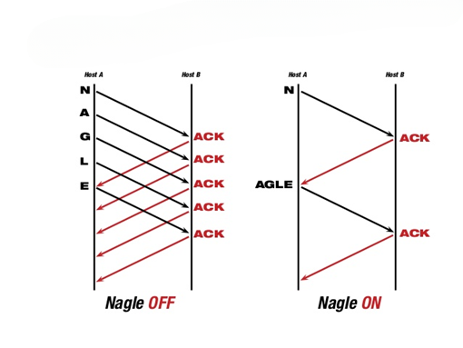

일반적으로 TCP 통신은 패킷을 받았는지 확인하기 위해 데이터를 받은 쪽에서 ACK 신호를 보낸다.
Nagle Algorithm은 네트워크의 효율성을 높이기 위해서, 출력할 데이터가 도착할 때마다 매번 보내는 것이 아니라, 지정된 크기를 모아서 보내는 방식이다.

장점
- 패킷이 줄어들기 때문에 네트워크 효율이 높아진다.
- 대역폭이 낮은 WAN에서 활용도가 높다.

단점
- ACK를 기다리기 때문에 전송이 진여되어 delay가 발생되고 속도가 저하된다.
- TCP에서만 사용 가능하고 UDP를 포함한 다른 프로토콜에서는 지원하지 않는다.
- 빠른 네트워크 응답이 필요한 곳에 부적합하다.

### Links

[TCP 네트워크 통신을위한 Nagle 알고리즘](https://ko.eyewated.com/tcp-%EB%84%A4%ED%8A%B8%EC%9B%8C%ED%81%AC-%ED%86%B5%EC%8B%A0%EC%9D%84%EC%9C%84%ED%95%9C-nagle-%EC%95%8C%EA%B3%A0%EB%A6%AC%EC%A6%98/)
