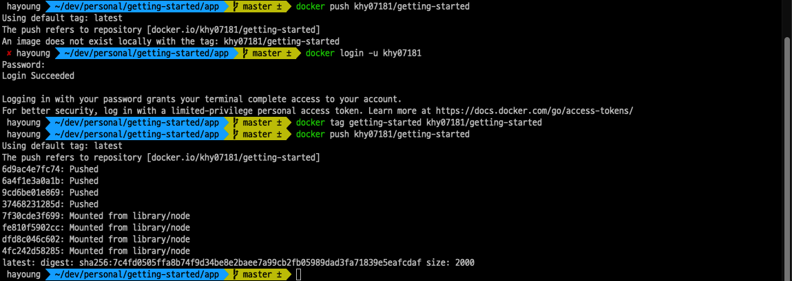

# Docker - Get started

### Docker

- 컨테이너 기반의 오픈소스 가상화 플랫폼
- 다른 모든 프로세스와 격리된 시스템의 샌드박스 프로세서
- 다양한 프로그램, 실행 환경을 컨테이너로 추상화하고 동일한 인터페이스를 제공하여 프로그램의 배포 및 관리를 단순하게 해준다.
- 백엔드 프로그램, DB 서버, 메시지 큐 등 어떤 프로그램도 컨테이너로 추상화 할 수 있다.

### Container

- 어플리케이션이 하나의 환경에서 다른 환경으로 빠르고 안정적이게 실행될 수 있도록 코드와 모든 종속성을 패키징하는 소프트웨어의 표준 단위이다.
- 컨테이너는 격리된 프로세스가 동작하는 기술이다.
- VM 비해 매우 빠르다.

### Image

- 컨테이너 실행에 필요한 파일과 설정값 등을 포함하고 있는 것
- 상태값을 가지지 않고 변하지 않는다.
	- immutable
- 컨테이너는 이미지를 실행한 상태이며 추가되거나 변하는 값은 컨테이너에 저장된다.
- 같은 이미지에서 여거 개의 컨테이너를 생성할 수 있고 컨테이너의 상태가 바뀌거나 컨테이너가 삭제되더라도 이미지는 변하지 않고 그대로 남아있다.
- 도커 이미지는 [Docker hub](https://hub.docker.com/)에 등록하거나 [Docker registry](https://docs.docker.com/registry/) 저장소를 직접 만들어 관리할 수 있다.

---

## Containerize an application

### Build the app’s container image

clone example code
- `git clone https://github.com/docker/getting-started.git`

Dockerfile 생성

```shell
# syntax=docker/dockerfile:1
FROM node:12-alpine
RUN apk add --no-cache python2 g++ make
WORKDIR /app
COPY . .
RUN yarn install --production
CMD ["node", "src/index.js"]
EXPOSE 3000
```

컨테이너 이미지 빌드
- `docker build -t getting-started .`

### Start an app container

docker 이름 지정 및 run
- `docker run -dp 3000:3000 getting-started`

http://localhost:3000/ 에 접속하면 다음과 같은 화면이 정상적으로 나온다.


Docker Desktop의 Dashboard에도 `getting-started` 이미지를 사용하고 3000 포트에서 실행 중인 컨테이너가 표시된다.


## Update the application

### Update the source code

- 예제 코드 기준 line 56 수정

```
 - <p className="text-center">No items yet! Add one above!</p>
 + <p className="text-center">You have no todo items yet! Add one above!</p>
 ...
```

image의 업데이트 된 버전 build
- `docker build -t getting-started .`

새로운 컨테이너 시작
- `docker run -dp 3000:3000 getting-started`

그러면 포트가 사용중이라는 오류가 난다.
- `port is already allocated`
- 이전 컨테이너가 실행되는 동안 새로운 컨테이너를 시작할 수 없다.
	- 이전 컨테이너가 호스트의 3000 포트를 사용하고 있기 때문

### Remove the old container

컨테이너 확인
- `docker ps`

컨테이너 중지
- `docker stop <the-container-id>`

컨테이너 삭제
- `docker rm <the-container-id>`

### Start the updated app container

새로운 컨테이너 실행
`docker run -dp 3000:3000 getting-started`

http://localhost:3000/ 에 접속하면 다음과 같은 수정된 화면이 정상적으로 나온다.


## Share the application

### 저장소 생성

1. [Docker Hub](https://hub.docker.com/)
2. Create Repository
3. repository 이름은 `getting-started`로 설정한다.


### image push

- docker push
	- `docker push khy07181/getting-started`
	- push하면 이미지를 찾지 못한다고 하는 에러가 발생한다.
- docker hub 로그인
	- `docker login -u khy07181`
- `docker tag` 명령을 사용하여 이미지 getting-started에 새 이름을 지정한다.
	- `docker tag getting-started khy07181/getting-started`
- docker push
	- `docker push khy07181/getting-started`


### 새 인스턴스에서 image 실행

- `docker run -dp 3000:3000 khy07181/getting-started`

## Persist the DB

- 현재는 컨테이너가 재시작 될 때마다 데이터가 지워진다.
- 컨테이너는 실행될 때 파일 시스템에 대한 이미지의 다양한 계층을 사용한다.
- 각 컨테이너에는 파일을 생성/업데이트/제거할 수 있는 자체 `scratch space` 가 있다.
- 따라서 동일한 이미지를 사용하더라도 다른 컨테이너에는 변경 사항이 표시되지 않는다.

### Container volumes

- [volumes](https://docs.docker.com/storage/volumes/)은 컨테이너의 특정 파일 시스템 경로를 호스트 시스템에 다시 연결하는 기능을 제공한다.
- 컨테이너의 디렉토리가 마운트되면 해당 디렉토리의 변경 사항도 호스트 시스템에 표시된다.
- 컨테이너가 다시 시작될 때 동일한 디렉토리를 마운트하면 동일한 파일이 표시된다.
- volumes에는 두 가지 타입이 있다.
	- named volumes
	- bind mounts

### Persist the todo data

- 여기서는 named volumes을 사용한다
- volume을 생성하고 데이터가 저장된 디렉토리에 연결(mount)하여 데이터를 유지할 수 있다.

1. Volume 생성
- `docker volume create todo-db`
2. 현재 volume 없이 실행 중인 컨테이너 제거
- `docker rm -f <id>`
3. volume mount 지정하여 컨테이너 실행
- `docker run -dp 3000:3000 -v todo-db:/etc/todos getting-started

이제 todo를 추가하고 컨테이너를 제거 후 다시 시작하더라도 todo 앱의 db 데이터는 그대로 유지된다!


### Dive into the volume

- `docker volume inspect` 명령을 사용하면 Docker가 실제로 데이터를 어디에 저장하는지 알 수 있다.
	- `Mountpoint` : 데이터가 저장되는 실제 위치이다.
	

## Multi-container apps

- 컨테이너는 기본적으로 격리되어 실행되기 때문에 다른 컨테이너에 대해 전혀 알지 못한다.
- 다른 컨테이너와 통신하도록 하려면 네트워킹을 사용해야 한다.

### 네트워크 생성

- `docker network create test-net`

### Postgresql에 연결하기

- `docker run -d --name test-postgres -p 5432:5432 -v postgres:/var/lib/postgresql/data --rm --network test-net khy07181/postgres`

docker inspect 를 사용하면 세부정보를 확인할 수 있다.
- `docker inspect test-postgres`
- network 설정이 `test-net`으로 설정되어 있다.

### 다른 컨테이너와 통신하기

- `docker run -d --name batch-practice -e PROFILE=prod --network test-net spring-batch-practice`
- 다른 컨테이너도 network에 연결하면 test-net에 연결된 컨테이너는 서로 통신이 가능하다.

## Docker compose

- docker compose는 multi container를 정의하고 설정하는 데 편리한 서비스를 제공한다.

### compost 파일 생성

- 프로젝트 root 경로에 `docker-compose.yml` 생성

```yml
services:  
  batch:  
    image: spring-batch-practice  
    container_name: batch  
    environment:  
      - SPRING_PROFILES_ACTIVE=prod  
    volumes:  
      - postgres:/var/lib/postgresql/data  
    networks:  
      - test-net  
  
  postgresql:  
    image: khy07181/postgres  
    container_name: postgres  
    ports:  
      - "5432:5432"  
    volumes:  
      - postgres:/var/lib/postgresql/data  
    networks:  
      - test-net  
  Docker 
volumes:  
  postgres:  
#    driver: local -- create new volume  
    external: true  
  
networks:  
  test-net:  
#    driver: bridge -- create new network  
    external: true
```

### docker compose 실행

- `docker compose up -d`
- docker compose logs -f

## Reference

- [Docker docs](https://docs.docker.com/get-started/)
